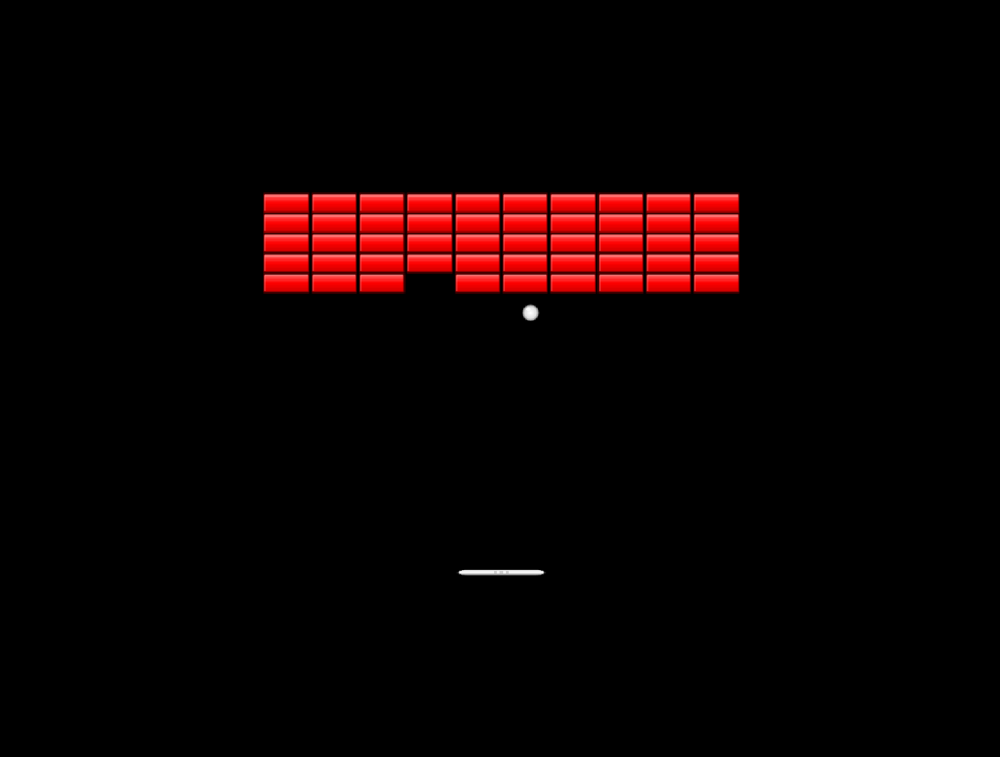

# Breakout Game for SolarSail

A classic Breakout/Arkanoid clone demonstrating physics, collision detection, and entity management in the SolarSail engine.



## Current Status

✅ **FULLY PLAYABLE** - All core mechanics implemented and optimized:
- Paddle movement with arrow keys/A/D
- Ball launching with SPACE
- Paddle-ball collision with angle control
- 50 bricks dynamically spawned
- Ball-brick collision and destruction with ray-cast collision detection
- Score tracking (10-50 points per brick)
- Lives system (3 lives)
- Game over and restart functionality

## Controls
- **Left/Right Arrow** or **A/D**: Move paddle
- **Space**: Launch ball / Start game
- **R**: Restart game
- **Q**: Quit

## Game Features
- Paddle with smooth movement
- Ball physics with velocity reflection
- Brick grid with different colors/points per row
- Score tracking and lives system
- Ball spin based on paddle hit position
- Progressive speed increase

## Technical Implementation

### Key Design Patterns

1. **Shared Game State**: Uses a `game_state.lua` module to share references between scripts
   - Avoids the need for entity lookups (which aren't available as globals in SolarSail)
   - Similar pattern to asteroids and snake demos

2. **Template System**: Bricks are created using `instantiateTemplate()`
   - Template defined in `game.json`
   - 50 instances created dynamically at runtime

3. **Ray-Cast Collision Detection**: Uses engine raycast methods for accurate collision
   - Prevents multi-collision bugs by checking entire movement path
   - Always hits closest brick first for proper temporal ordering

4. **Frame-Independent Movement**: Uses `Time.deltaTime` for all physics
   - Ensures consistent gameplay at any framerate

5. **Component Pattern**: Each game object (paddle, ball, brick) has its own script
   - Promotes code organization and reusability

### File Structure
- `game.json` - Scene definition with entities and templates
- `program.lua` - Main engine callbacks
- `game_controller.lua` - Game logic, scoring, lives
- `paddle.lua` - Paddle movement logic
- `ball.lua` - Ball physics and collision detection
- `brick.lua` - Brick destruction behavior
- `game_state.lua` - Shared state between scripts
- `config.lua` - Game configuration (speeds, sizes, etc.)

## Creating Graphics with Transparent Backgrounds

### Process for Creating Game Sprites

1. **Create SVG files** with transparent backgrounds:
   - `ball.svg` - 32x32 ball with radial gradient
   - `paddle.svg` - 64x16 paddle with metallic gradient
   - `brick.svg` - 48x16 brick with 3D bevel effect

2. **Convert SVG to PNG** using Inkscape CLI:
   ```bash
   inkscape ball.svg -o ball.png -w 32 -h 32
   inkscape paddle.svg -o paddle.png -w 64 -h 16
   inkscape brick.svg -o brick.png -w 48 -h 16
   ```

3. **Create different colored bricks** (optional):
   ```bash
   # Edit brick.svg to change colors, then convert each variant
   inkscape brick_red.svg -o brick_red.png -w 48 -h 16
   inkscape brick_orange.svg -o brick_orange.png -w 48 -h 16
   # etc...
   ```

4. **Combine into atlas**:
   ```bash
   # Create a blank transparent canvas for the atlas
   convert -size 128x64 xc:transparent atlas.png
   
   # Composite sprites onto the atlas at specific positions
   convert atlas.png ball.png -geometry +0+0 -composite atlas.png      # Ball at (0,0)
   convert atlas.png paddle.png -geometry +32+0 -composite atlas.png   # Paddle at (32,0)
   convert atlas.png brick.png -geometry +0+32 -composite atlas.png    # Brick at (0,32)
   ```

   **Atlas Layout:**
   ```
   0,0    32,0         96,0
   +------+------------+
   | Ball | Paddle     |
   | 32x32| 64x16      |
   +------+------------+
   | Brick            |
   | 48x16            |
   +------------------+
   0,32              48,32
   ```

5. **Update atlas.lua** to match sprite positions:
   ```lua
   -- Ball sprite
   sprite = addsprite()
   sprite.name = "ball"
   sprite.frame.x = 0      -- X position in atlas
   sprite.frame.y = 0      -- Y position in atlas
   sprite.frame.width = 32
   sprite.frame.height = 32
   
   -- Paddle sprite
   sprite = addsprite()
   sprite.name = "paddle"
   sprite.frame.x = 32     -- Positioned right of ball
   sprite.frame.y = 0
   sprite.frame.width = 64
   sprite.frame.height = 16
   
   -- Brick sprite
   sprite = addsprite()
   sprite.name = "brick"
   sprite.frame.x = 0      -- New row below ball
   sprite.frame.y = 32
   sprite.frame.width = 48
   sprite.frame.height = 16
   ```

### SVG Design Tips
- Use gradients for 3D effects (radial for spheres, linear for flat surfaces)
- Add subtle highlights and shadows
- Keep stroke widths consistent (1px works well at these sizes)
- Use opacity for softer highlights
- Design at exact pixel dimensions to avoid scaling artifacts

### Why Use an Atlas?
- **Performance**: Single texture = fewer draw calls
- **Memory**: More efficient than loading multiple textures
- **Simplicity**: One file to manage instead of many

### Atlas Packing Strategy
1. **Plan the layout** - Draw it on paper first
2. **Use power-of-2 dimensions** when possible (128x64 in our case)
3. **Leave transparent padding** between sprites to avoid bleeding
4. **Group related sprites** together (all bricks in one area, etc.)
5. **Document the layout** in your README for future reference

## Building and Running
```bash
make
```

## Implementation Notes
- Uses SolarSail's Entity Component System
- All coordinates in world space (-1.78 to 1.78 for X, -1 to 1 for Y)
- Collision detection uses AABB (Axis-Aligned Bounding Box)
- Ball velocity reflection based on surface normals
- Paddle hit position affects ball trajectory for player control

## Potential Enhancements
- Visual score display (currently console only)
- Sound effects and music
- Power-ups (multi-ball, wider paddle, etc.)
- Different brick patterns/levels
- High score tracking
- Particle effects for brick destruction
- Multiple ball support
- Special bricks (unbreakable, multi-hit, etc.)